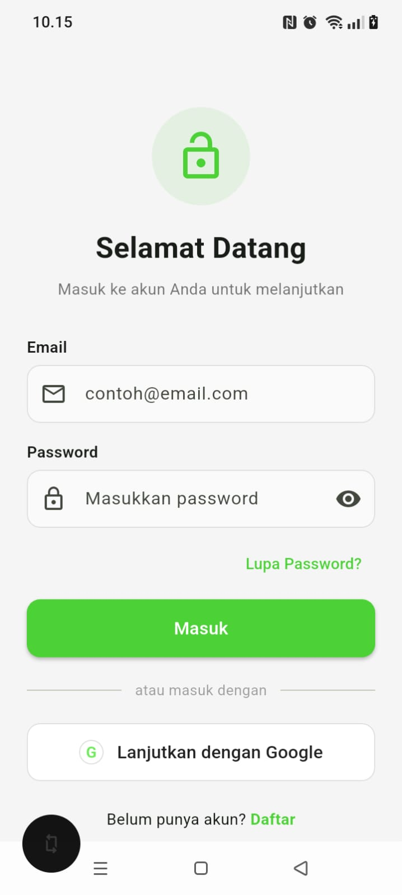
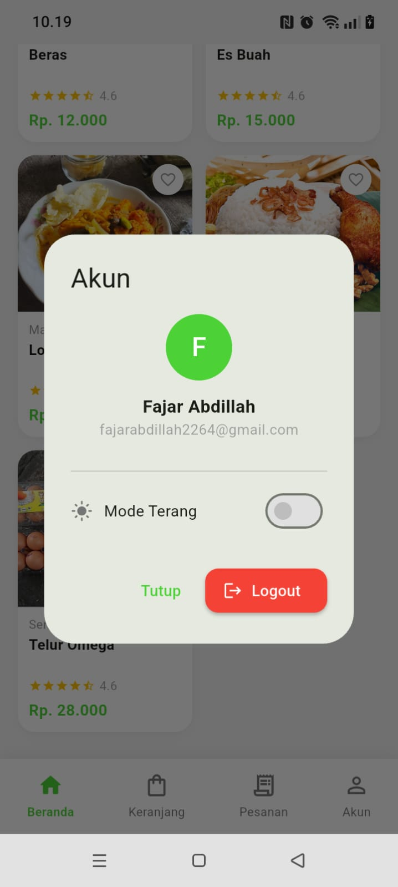
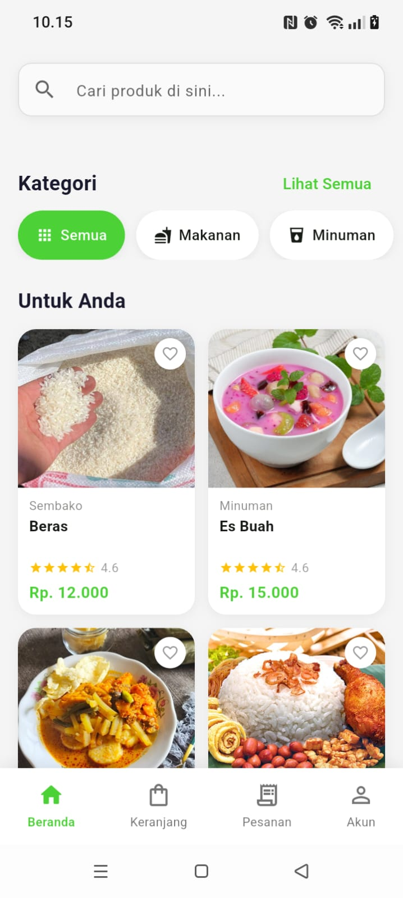
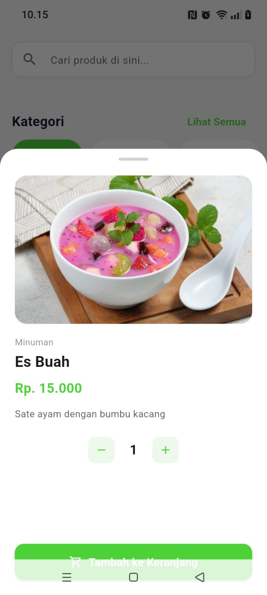
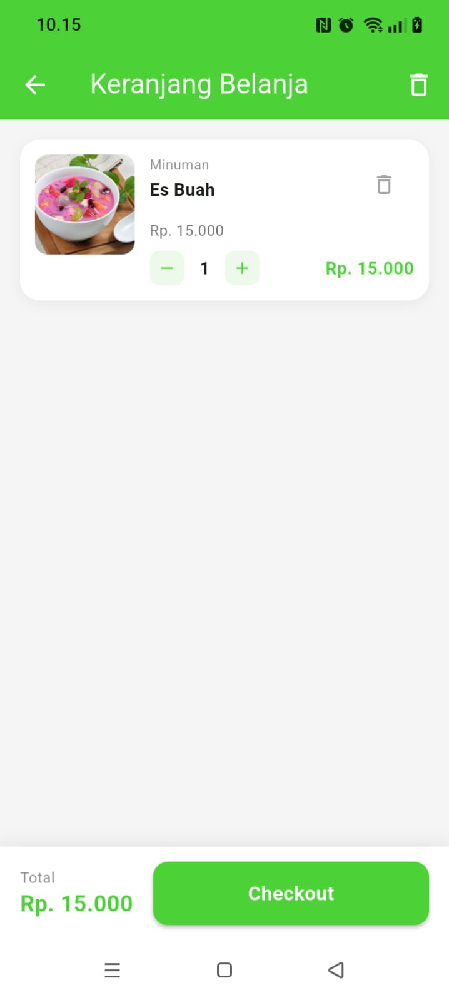
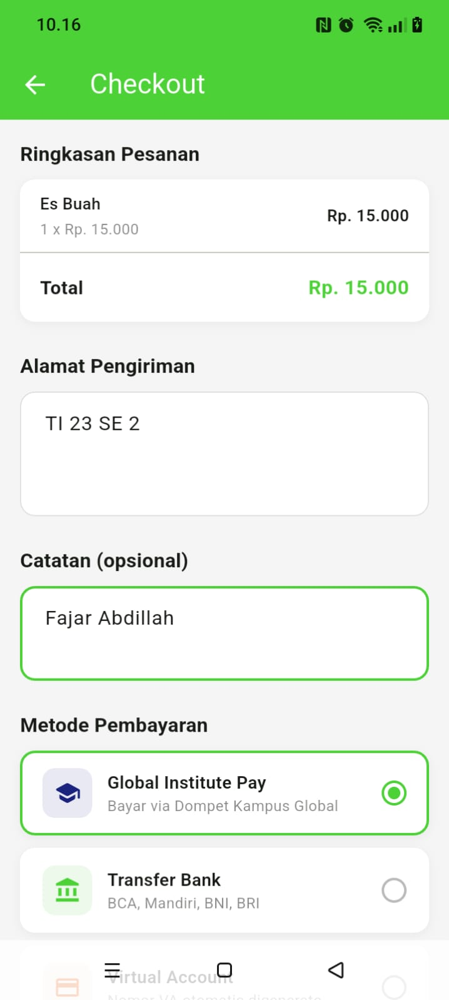
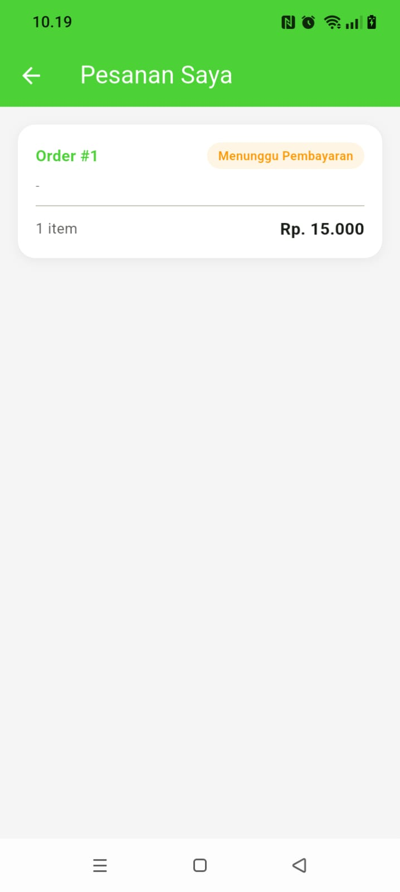

# 🛒 Jajan Skuy — Aplikasi Kantin Digital Ekosistem Kampus Global

Jajan Skuy adalah platform kantin digital pintar yang dirancang khusus untuk memodernisasi sistem pemesanan makanan dan minuman di lingkungan Kampus Global. Aplikasi ini memfasilitasi mahasiswa untuk menjelajahi menu, memesan makanan dari berbagai merchant, dan bertransaksi secara instan tanpa perlu mengantre lama di area kantin.

---

## 📌 Deskripsi Aplikasi

Aplikasi ini bertindak sebagai perantara digital (*frontend marketplace*) yang mempertemukan civitas akademika dengan para pelaku usaha/merchant makanan di lingkungan kampus. Dibangun menggunakan teknologi **Flutter** yang responsif pada sisi frontend dan didukung oleh **Golang (Gin Framework)** pada sisi backend, Jajan Skuy menawarkan pengalaman memesan makanan yang cepat, transparan, dan terintegrasi dengan ekosistem digital kampus.

### 🌟 Fitur Utama & Keunggulan
* **Smart Ordering System**: Jelajahi menu makanan, dan buat pesanan secara terjadwal atau instan.
* **Digital Cart & Checkout**: Manajemen keranjang belanja dengan sistem kalkulasi harga otomatis.
* **Instant Order Status**: Pantau status pembuatan makanan secara langsung lewat notifikasi sistem.
* **Firebase Push & Local Notifications**: Notifikasi real-time yang menjamin pengguna mengetahui saat makanan siap diambil di konter kantin.
* **Biometric App Lock Security**: Keamanan aplikasi yang diperketat melalui integrasi pemindai sidik jari/wajah (*fingerprint/face unlock*) lokal.

---

## 🏗️ Arsitektur Aplikasi

Proyek frontend Jajan Skuy mengimplementasikan pola **Feature-First Clean Architecture** yang dikombinasikan dengan state management **Provider**. Pola ini membagi kode berdasarkan fitur fungsional utama (*auth, cart, dashboard, order*) untuk mempermudah skalabilitas tim.

```text
lib/
├── core/
│   ├── constants/      # Variabel global tetap (Base URL, endpoints)
│   ├── providers/      # Provider global penyedia data sistem
│   ├── routes/         # Manajemen navigasi dan deep links
│   ├── services/       # Layanan infrastruktur pihak ketiga
│   ├── theme/          # Konfigurasi visual UI, font, dan warna
│   └── widgets/        # Komponen UI global yang dapat dipakai berulang
└── features/
    ├── auth/           # Fitur Autentikasi Pengguna
    │   ├── data/       # Model & sumber data lokal/remote untuk auth
    │   ├── domain/     # Entitas bisnis inti & usecases untuk auth
    │   └── presentation/ # Halaman UI, widget, dan provider lokal auth
    ├── cart/           # Fitur Manajemen Keranjang Belanja
    │   ├── data/       # Model & repositori data keranjang
    │   ├── domain/     # Logika bisnis manipulasi item keranjang
    │   └── presentation/ # UI halaman keranjang & status pemesanan
    ├── dashboard/      # Fitur Halaman Utama & Eksplorasi Menu
    │   ├── data/       # Ambil data menu makanan & merchant dari API
    │   ├── domain/     # Logika bisnis rekomendasi makanan
    │   └── presentation/ # Tampilan beranda kantin & komponen widget
    └── order/          # Fitur Riwayat & Pelacakan Pesanan Aktif
        ├── data/       # Logika pengambilan riwayat transaksi
        ├── domain/     # Logika bisnis pemrosesan nota belanja
        └── presentation/ # Layanan layar status pesanan & rincian nota
```

---

## 🔗 Link Repositori Ekosistem

Berikut adalah repositori backend serta pustaka eksternal yang mendukung operasional aplikasi Jajan Skuy:

* **Backend Jajan Skuy:** [GitHub - BE Jajan Skuy](https://github.com/AbdillahFajar/jajanskuy-be)
* **Pustaka Biometrik Eksternal:** [GitHub - Flutter Biometric Kit](https://github.com/AbdillahFajar/flutter_biometic_kit)

---

## 🚀 Cara Menjalankan Proyek

### 1. Kloning Repositori
Pastikan Anda mengkloning proyek **Jajan Skuy** dan pustaka **Flutter Biometric Kit** di dalam satu direktori induk yang sama agar jalur (*path reference*) lokal tidak mengalami error saat dikompilasi.

```bash

# Clone Library Biometrik Lokal
git clone https://github.com/AbdillahFajar/flutter_biometic_kit

# Clone Frontend Jajan Skuy (Pastikan sejajar dengan folder di atas)
git clone https://github.com/AbdillahFajar/jajanskuy

# Clone Backend Jajan Skuy
git clone https://github.com/AbdillahFajar/jajanskuy-be
```

### 2. Menjalankan Backend (BE)
Buat file `.env` di direktori root backend dan lengkapi konfigurasi berikut (tanpa Redis, SMTP, dan OTP):
```env
APP_PORT=8082
DB_HOST=
DB_PORT=
DB_USER=
DB_PASSWORD=
DB_NAME=
JWT_SECRET_KEY=
JWT_EXPIRATION=
FIREBASE_CREDENTIALS_PATH=
```
Eksekusi kontrol panel database lokal Anda (XAMPP / Laragon / phpMyAdmin) lalu jalankan server:
1. Buka aplikasi kontrol panel Anda (contoh: **XAMPP** atau **Laragon**).
2. Klik tombol **Start** pada layanan **Apache** dan **MySQL**.
3. Buka browser dan akses halaman kontrol panel di `http://localhost/phpmyadmin`.
4. Buat database baru dengan nama sesuai variabel `DB_NAME` pada file `.env`.
5. Buat user database baru atau gunakan user bawaan (`root` tanpa password) sesuai dengan konfigurasi file `.env`.
6. Jalankan server Backend lewat terminal:
   ```bash
   go run main.go
   ```

### 3. Menjalankan Frontend (FE)
```bash
# 1. Masuk ke direktori frontend jajan skuy
cd jajanskuy

# 2. Ambil semua dependensi proyek
flutter pub get

# 3. Cek IP Address Wi-Fi komputer Anda lewat terminal
ipconfig

# 4. Buka file `lib/core/constants/api_constants.dart` 
#    dan perbarui `baseUrl` sesuai dengan IP Address Wi-Fi di atas.

# 5. Hubungkan HP menggunakan kabel data (Aktifkan Developer Mode & USB Debugging)

# 6. Jalankan perintah ADB port forwarding untuk menjamin konektivitas lokal
adb reverse tcp:8082 tcp:8082
adb devices

# 7. Jalankan proyek melalui tab 'Run and Debug' di VS Code atau terminal:
flutter run
```

---

## 📦 Daftar Dependensi Utama

Berikut adalah pustaka utama yang digunakan dalam proyek ini berdasarkan berkas `pubspec.yaml`:

| Kategori | Package | Versi | Deskripsi |
|---|---|---|---|
| **Icons** | `cupertino_icons` | `^1.0.8` | Aset ikon standar bawaan Apple style |
| **Firebase** | `firebase_core` | `^4.6.0` | Inisialisasi utama sistem Firebase di aplikasi |
| | `firebase_auth` | `^6.3.0` | Manajemen autentikasi kredensial pengguna |
| | `firebase_messaging` | `^16.1.3` | Penerima real-time Push Notification background |
| **Notifications** | `flutter_local_notifications` | `^18.0.0` | Pengelola tampilan notifikasi lokal di area foreground |
| **State Management**| `provider` | `^6.1.5+1` | Manajemen status state widget yang efisien & ringan |
| **Authentication** | `google_sign_in` | `^6.2.2` | Layanan integrasi Google OAuth Login sistem |
| **Local Storage** | `flutter_secure_storage` | `^10.0.0` | Enkripsi data sensitif (token) di penyimpanan perangkat |
| **Network** | `dio` | `^5.9.2` | HTTP Client tangguh untuk komunikasi data REST API |
| **Validation** | `email_validator` | `^3.0.0` | Helper validasi struktur sintaks penulisan email |
| **Utility** | `equatable` | `^2.0.5` | Pembandingan objek tanpa override operator secara manual |
| **Navigation Link** | `url_launcher` | `^6.3.2` | Membuka link halaman web eksternal melalui browser |
| **Deep Links** | `app_links` | `^7.1.2` | Menangani custom URL schemes & HTTPS App Links |
| **Local Library** | `flutter_biometric_kit` | *Path-Local* | Pustaka internal kustom pengunci sistem biometrik lokal |
| **Tools** | `flutter_launcher_icons` | `^0.14.4` | Pembuat aset ikon aplikasi smartphone otomatis |

### 🛠️ Spesifikasi Kebutuhan Lingkungan Android
Berdasarkan target spesifikasi SDK Flutter (`^3.12.2`), berikut adalah standar pemenuhan perangkat minimum yang didukung proyek:
* **Minimum Android SDK (minSdkVersion):** `23` (Android 6.0 Marshmallow) demi menjamin kestabilan API pemindai biometrik bawaan serta pustaka notifikasi lokal.
* **Target Android SDK (targetSdkVersion):** `34` (Android 14) untuk memenuhi standar kepatuhan regulasi privasi Google Play Store terbaru.

---

## 📸 Screenshot Aplikasi

Berikut adalah tampilan antarmuka pengguna (UI) dari aplikasi **Jajan Skuy** untuk alur utama pemesanan makanan:

### 🔐 Autentikasi & Profil

| Login Page | Account Page |
| :---: | :---: |
|  |  |

### 🍔 Eksplorasi Menu & Pemesanan

| Dashboard | Product Detail Page |
| :---: | :---: |
|  |  |

### 🛒 Keranjang & Status Transaksi

| Cart Page | Checkout Page | Order Page |
| :---: | :---: | :---: |
|  |   | |

---